
<h1 align="center">大学生双创竟赛项目申报与路演管理系统</h1>

## 简介
大学生双创竞赛项目申报与路演管理系统，提供注册、项目申报、路演管理及用户管理等功能模块，支持创新创业项目的评审与管理，界面简洁清晰，提升用户体验，促进大学生创新创业活动开展。    --计算机毕业设计源码；毕设源码；java毕业设计源码

## 联系方式

<h3 align="center">获取完整代码与数据库文件 + 微信：deepguan QQ: 86050149 QQ群: 783742310</h3>

<h3 align="center">可帮忙远程部署 包运行成功！提供远程部署、修改代码、设计文档指导、代码讲解等服务！</h3>

## 功能介绍（完整见运行截图）
管理员：具备用户和项目的管理权限，包括查看和删除项目、审核双创项目申报和路演项目信息。可以为学生和专家创建及修改账户信息，分配不同用户角色，确保系统的正常运行。通过管理导航栏下的不同功能模块，如学生管理、专家管理、创新创业评审管理实现操作。

学生：可通过注册功能创建账户，并填写个人及项目申报信息，包括姓名、学号、项目名称等。能够管理自己申报的创新创业项目以及参与的路演活动，查看和编辑个人信息，通过系统上传项目材料和路演视频，参加项目评审及管理自己的评分和反馈。

专家：可以注册并管理个人账户信息，参与创新创业项目和路演活动的评审。具备查看和评审路演项目的权限，通过输入框输入评分与评审结果。负责根据自己领域的经验对申报项目提供专业意见，并在系统内完成评审任务。

用户：包括注册和登录两个基本功能模块，允许用户选择注册为学生或专家账户。访问系统首页查看导航菜单，通过其指引访问不同功能模块，体验项目申报、评审及管理整个流程，同时可以通过个人中心修改个人信息，管理个人参与的项目和活动。

## 运行截图
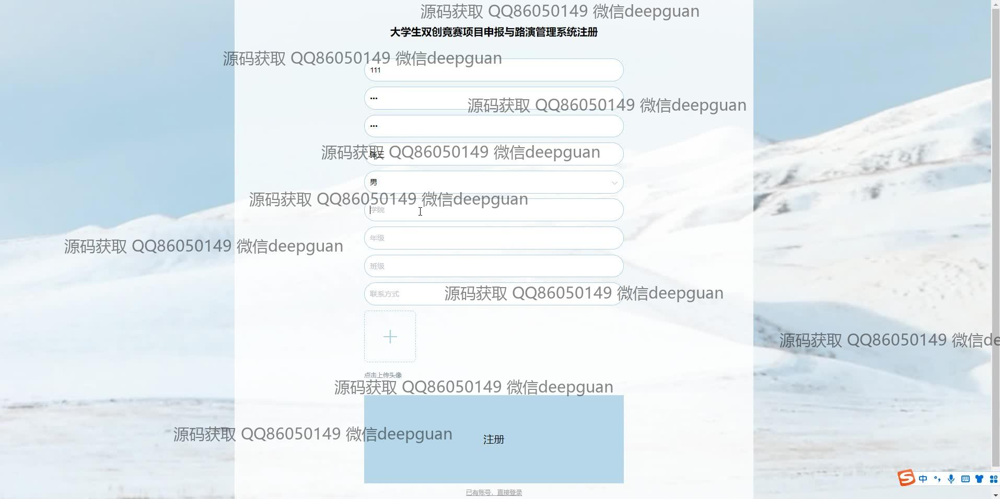
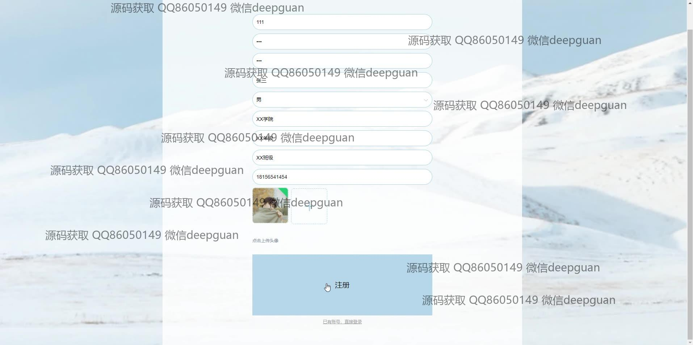
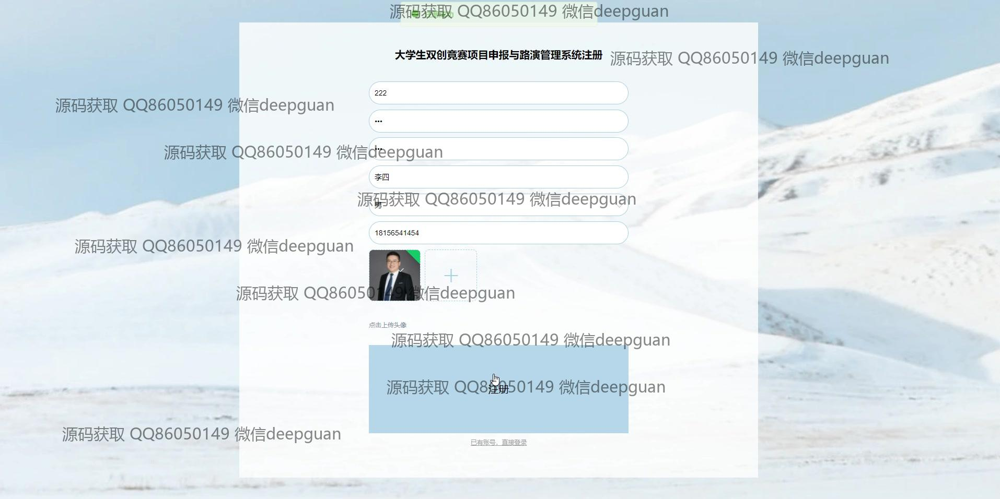
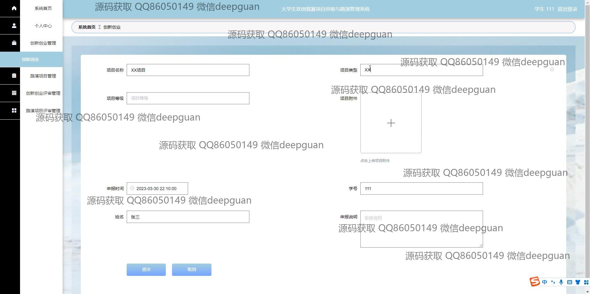
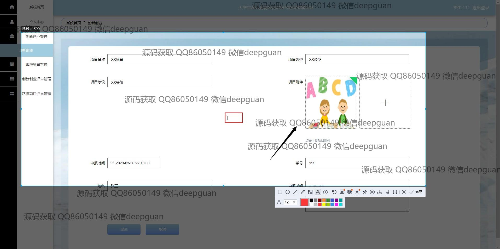
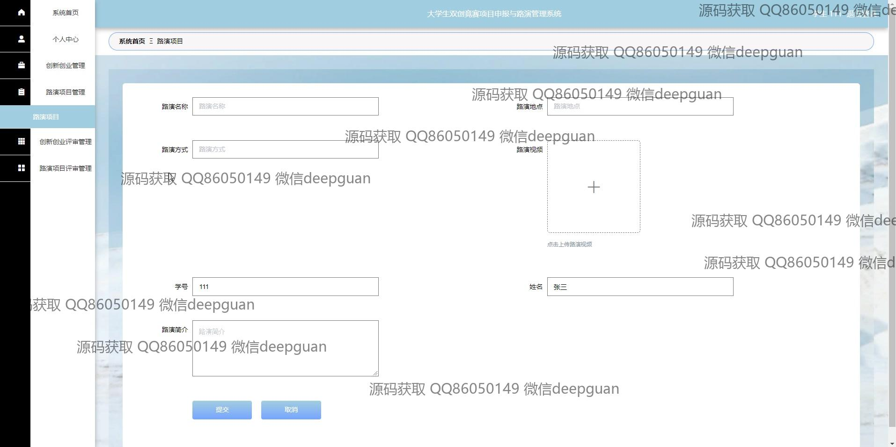
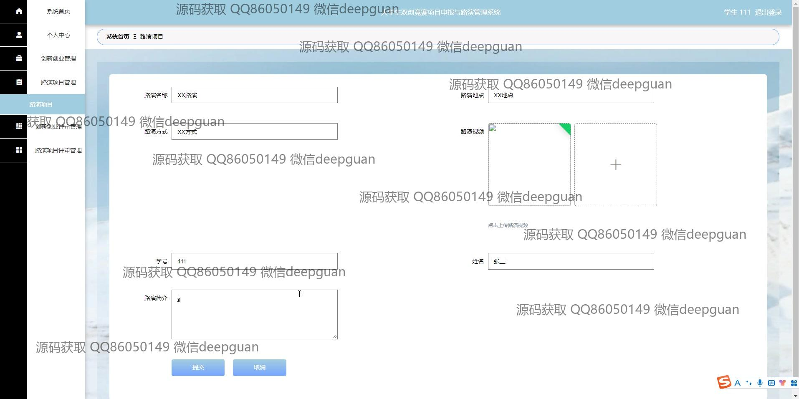
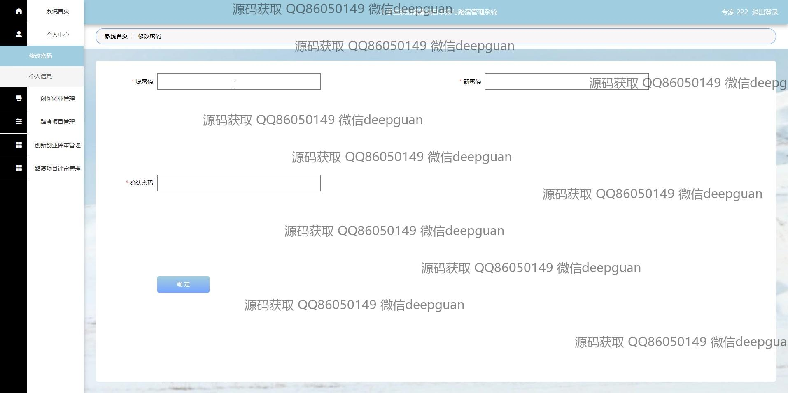
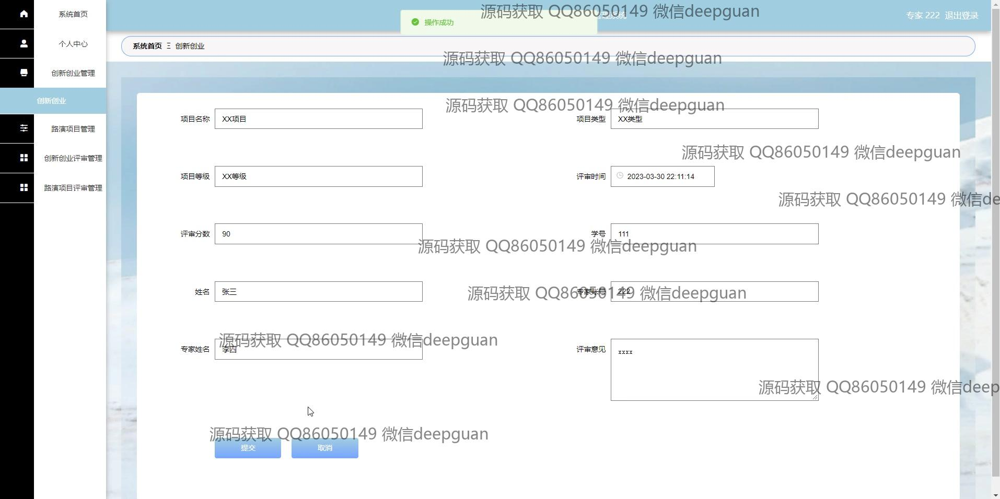

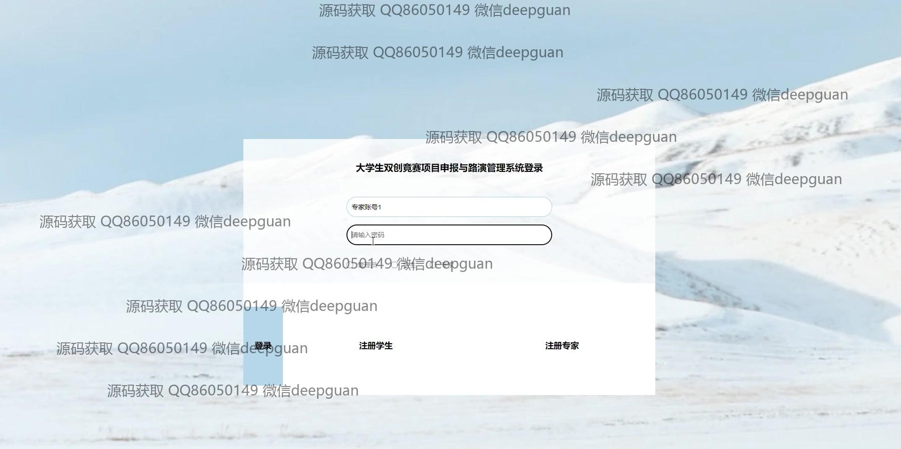
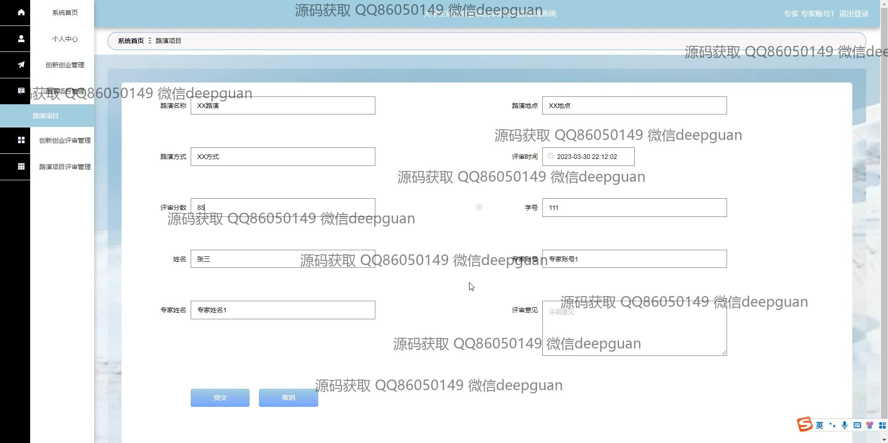
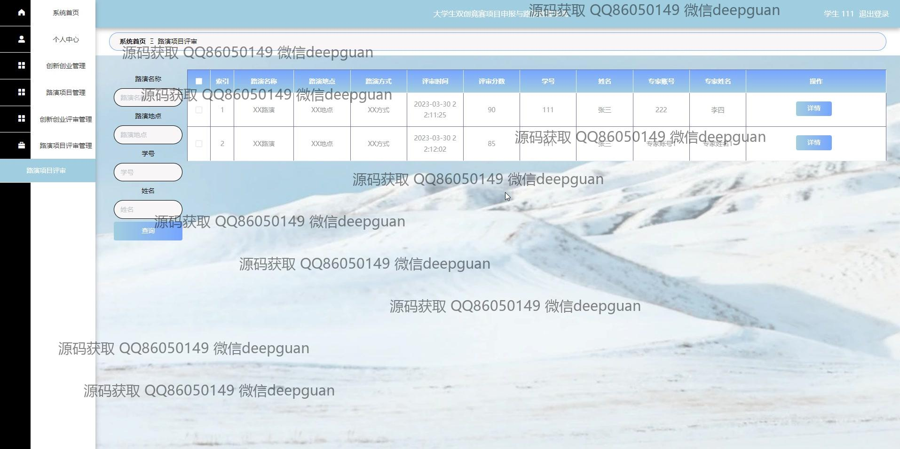
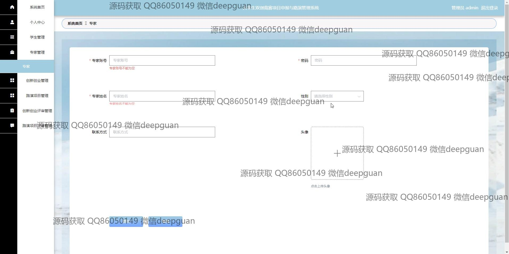
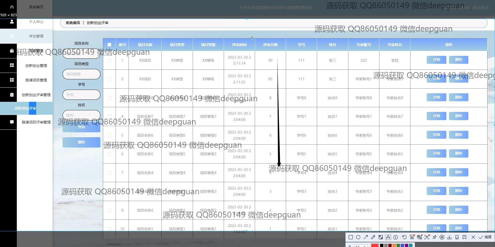
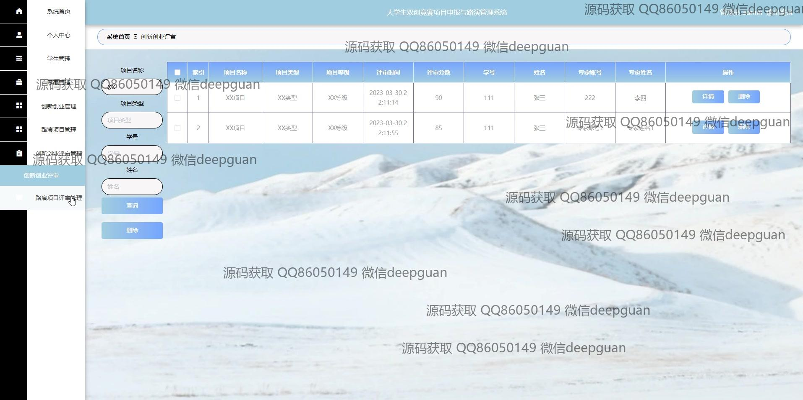

本代码来源于网络,仅供学习参考使用!

